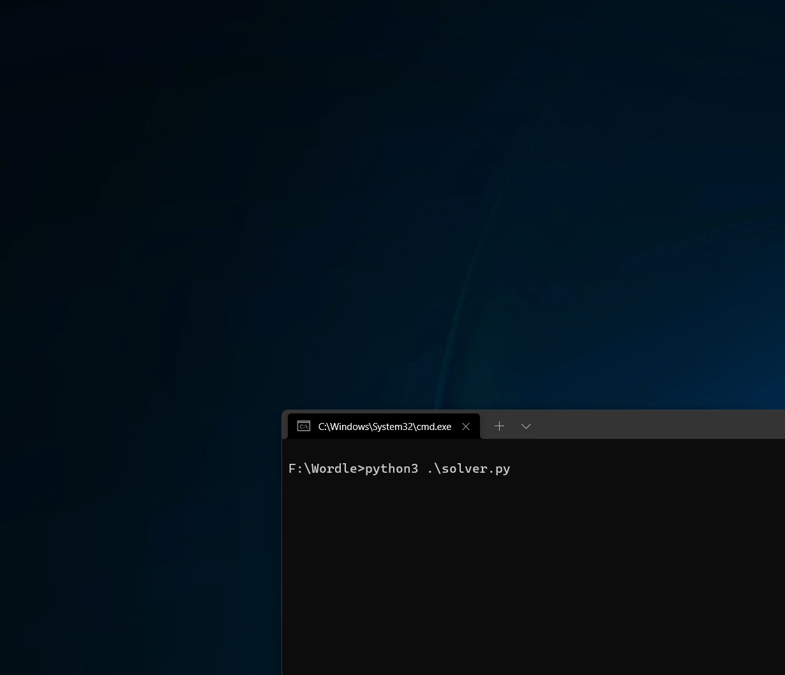

# Wordle Solver
This is a python program I wrote to solve wordle puzzles that can be found here: https://www.powerlanguage.co.uk/wordle/

# Instructions
1. Download this project
2. Download geckodriver and place it in the project directory
3. Make modifications to the script as needed to change the filename of your geckodriver executable

GeckoDriver can be found here:
https://github.com/mozilla/geckodriver/releases

 
Ensure you have firefox installed, or modify the code to work with another browser and use the appropriate driver:

https://www.selenium.dev/documentation/webdriver/getting_started/install_drivers/

# Example

